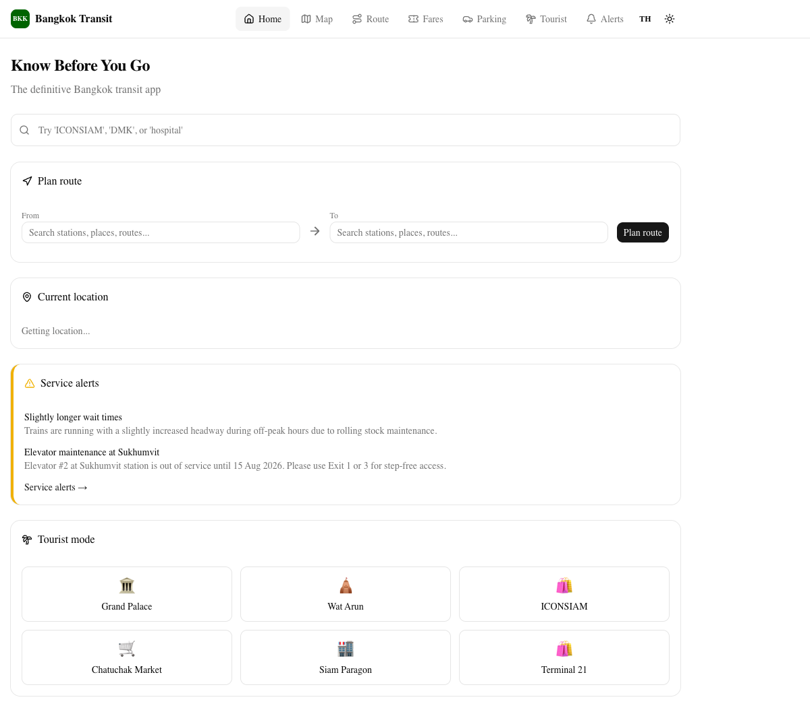
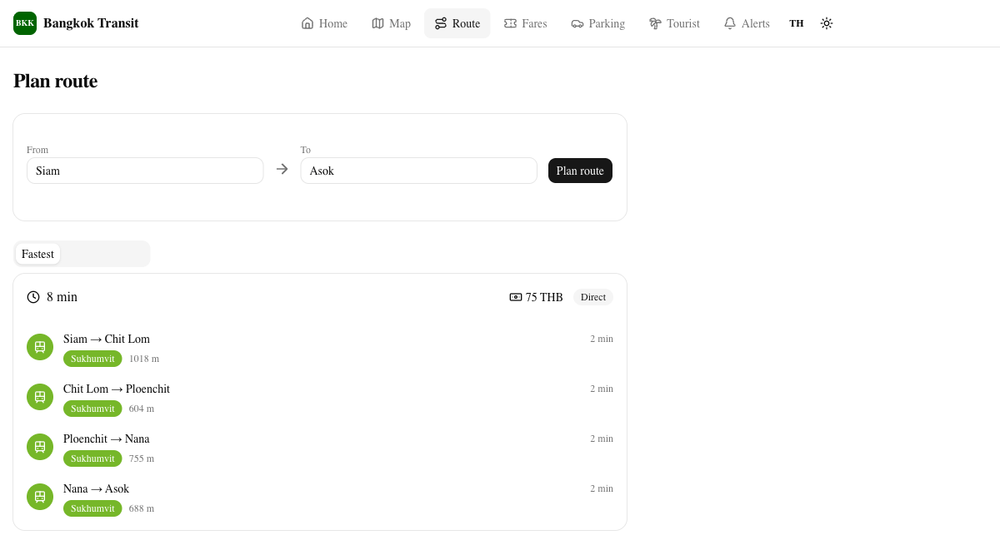
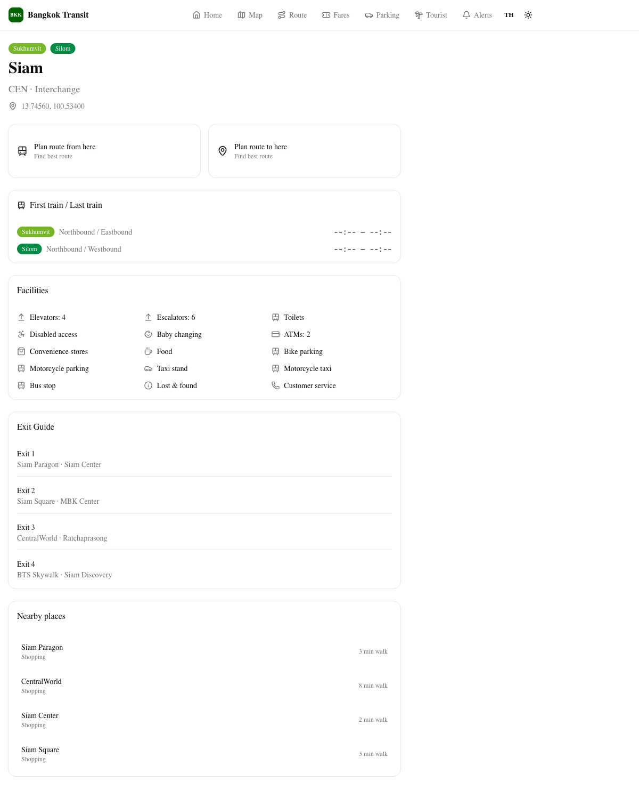
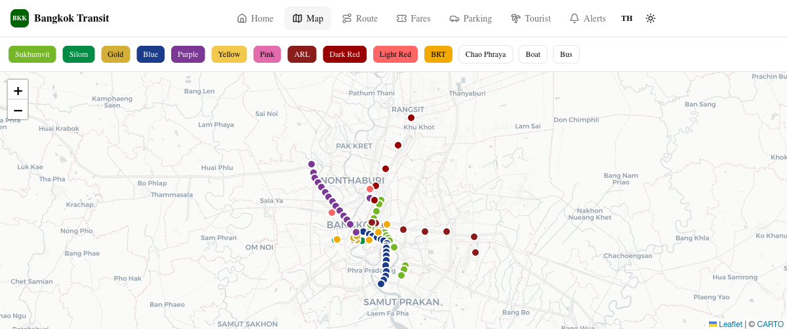

# Bangkok Transit

The definitive free Bangkok transit app — an interactive map, route planner, fare calculator, station details, exit guides, parking info, service alerts, and offline PWA for BTS, MRT, Airport Rail Link, SRT Red Lines, BRT, boats, and buses.






## Features

- **Know Before You Go dashboard** — route, time, fare, exit, parking, alerts, and weather in one place
- **Interactive map** — real map with all rail, boat, and bus stops (schematic map coming soon)
- **Route planner** — fastest, cheapest, fewest-transfer, accessible, and luggage-friendly options
- **Station pages** — names in Thai + English, first/last trains, facilities, exits, nearby places
- **Fare calculator** — compare single ticket, Rabbit, EMV, tourist pass, day pass
- **Parking map** — Park & Ride locations with capacity, cost, and hours
- **Tourist mode** — one-tap navigation to Grand Palace, Wat Arun, ICONSIAM, Chatuchak, Siam, Terminal 21
- **Service alerts** — disruptions, elevator outages, line closures
- **Offline PWA** — install on iOS/Android and use maps, station info, fares, and timetables offline
- **Thai + English UI** — full Thai language support, English native default

## Tech Stack

- Next.js 16 App Router
- Tailwind CSS v4 + shadcn/ui (Base UI)
- TypeScript
- Serwist PWA
- Leaflet real map
- Zustand (state), Zod (schemas), Fuse.js (search)

## Data Model

Everything is data-driven in `data/canonical/`:

```
operators → lines → stations → exits → facilities → timetables → fares → parking → places → alerts → boat_routes → bus_routes
```

Planned: Python scrapers in `scripts/scrape/` + GitHub Actions for daily/weekly updates.

## Getting Started

```bash
npm install
npm run dev
# Open http://localhost:3000
```

## Build

```bash
npm run build
npm start
```

Note: Production build uses `--webpack` because Serwist requires webpack in Next.js 16.

## Deploy

Ready for Vercel. Connect the GitHub repo and deploy.

## Roadmap

- [x] Project scaffold + PWA
- [x] Data schemas + canonical seed data
- [x] Interactive real map
- [x] Station pages + facilities + exits
- [x] Route planner (rail + boat + bus)
- [x] Fare calculator + ticket guide
- [x] Parking + tourist + alerts pages
- [x] Thai/English i18n
- [ ] Schematic SVG map
- [ ] Python scrapers + GitHub Actions
- [ ] Live service alerts from official sources
- [ ] Weather-aware routing
- [ ] Accessibility-first route option
- [ ] Crowding estimates
- [ ] Full fare matrices

## License

MIT
